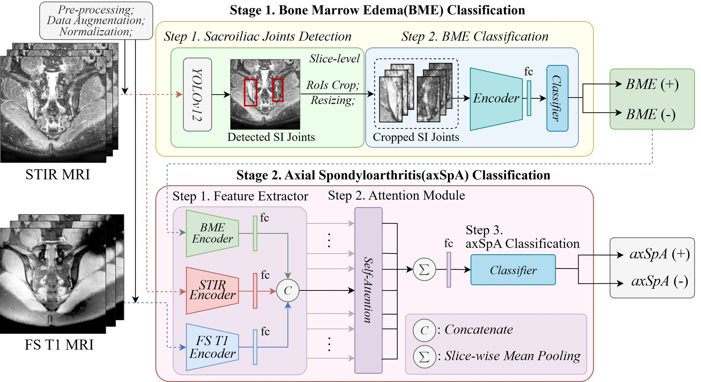
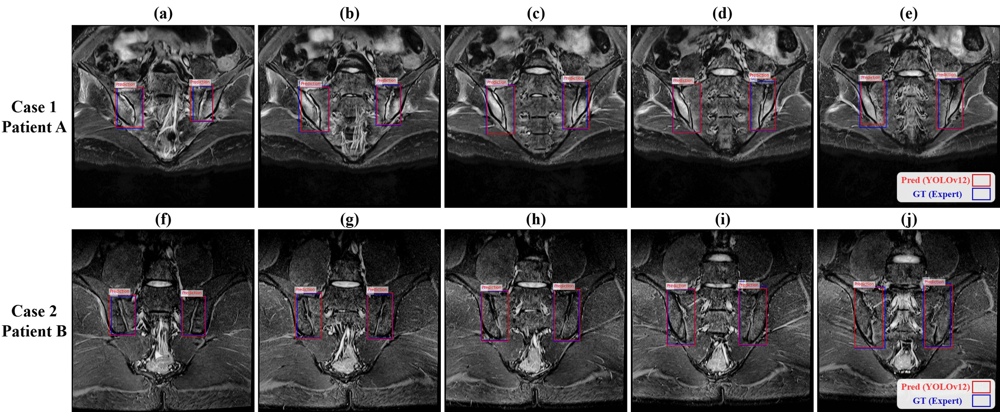
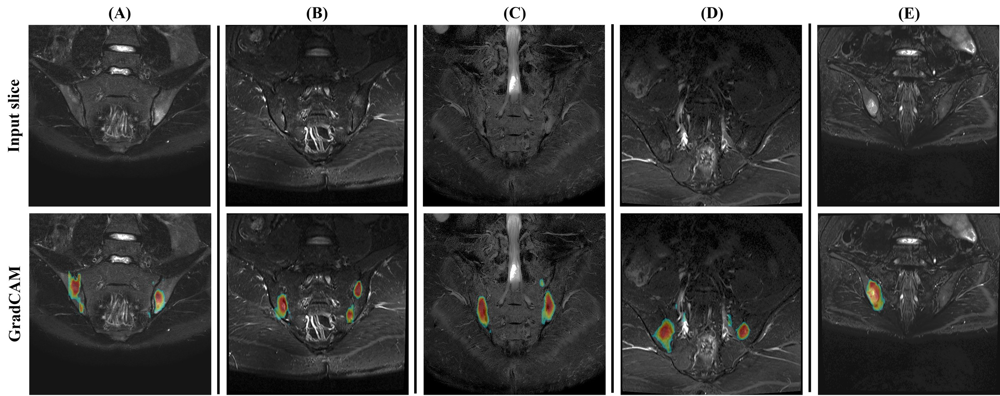
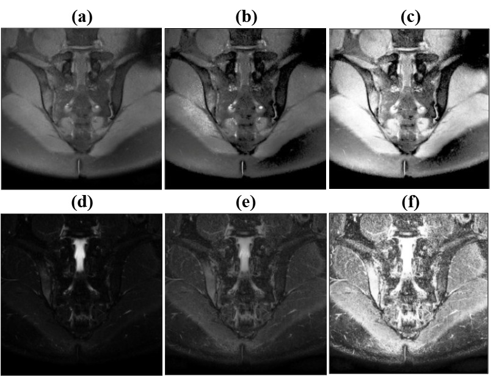

# SMC-axSpA-classification

Image-only deep learning framework for **axial spondyloarthritis (axSpA)** assessment from sacroiliac joint (SIJ) MRI, integrating fat-suppressed T1-weighted (FS T1) and short tau inversion recovery (STIR) sequences.

This repository contains the research code for:

> **Artificial intelligence-based decision support for axial spondyloarthritis integrating inflammatory and structural MRI information**
> Kim Y†, Lee S†, Kang S, Lee J, Chung MJ, Lee JH, Yoo H\*, Cha HS\*
> *Frontiers in Medicine* (under revision) · †equal contribution · \*corresponding authors

---

## Overview

Interpreting SIJ MRI is labor-intensive and subject to inter-reader variability. Most prior AI work predicts a single imaging finding — bone marrow edema (BME) — which is neither fully sensitive nor specific for axSpA. This framework instead approximates the **clinical diagnosis** made by the treating rheumatologist, using MRI alone and no clinical variables.

The pipeline runs in two stages:



**Stage 1** localizes the left and right SIJs on STIR with a YOLOv12x detector, then classifies BME in each cropped region of interest with a ConvNeXt-Large encoder. A slice is BME-positive if either joint shows edema.

**Stage 2** extracts features from FS T1 and STIR with EfficientNet-B4 encoders, processes the Stage 1 binary BME predictions through a parallel encoder, concatenates the modality-specific features per slice, and aggregates them across slices with a self-attention module followed by slice-wise mean pooling — upweighting diagnostically informative slices — before a fully connected classifier outputs the patient-level probability of axSpA.

## Results

Internal hold-out test set, 57 patients (32 axSpA / 25 non-axSpA):

| Stage | Task | Metric | Value |
|---|---|---|---|
| 1 | SIJ localization | mAP@0.5 | 0.9852 |
| 1 | BME classification (ROI-level) | AUROC | 0.9186 |
| 1 | BME classification (ROI-level) | Sensitivity | 0.8938 |
| **2** | **axSpA classification (patient-level)** | **AUROC** | **0.9412** |
| 2 | axSpA classification | Accuracy | 0.860 |
| 2 | axSpA classification | Sensitivity | 0.875 |
| 2 | axSpA classification | Specificity | 0.840 |

No statistically significant paired differences in accuracy, sensitivity, or specificity were detected between the model and either the ASAS "positive MRI" definition or the ASAS classification criteria (exact McNemar tests). Among 10 cases discordant between the ASAS "positive MRI" assessment and the clinical diagnosis, the model correctly classified 7.

### SIJ localization



Two representative test patients, five sequential coronal STIR slices each — Case 1 (a–e) and Case 2 (f–j). YOLOv12 predictions are outlined in red and expert ground-truth boxes in blue; the two largely overlap across consecutive slices.

### Model attention



Grad-CAM of the BME classifier on five representative slices: input slice (top) and overlay (bottom). Activations consistently localize to the periarticular regions adjacent to the SIJs rather than to unrelated pelvic structures.

## Dataset

Retrospective single-center cohort from Samsung Medical Center: 302 adults with chronic back pain who underwent SIJ MRI between January 2010 and December 2021; 11 excluded, **291 analyzed** (163 axSpA / 128 non-axSpA).

Splits are patient-wise and mutually exclusive, identical across all three tasks, so no patient appears in more than one subset:

| Stage | Task | Level | Total | Train | Val | Test |
|---|---|---|---|---|---|---|
| 1 | SIJ localization | slice | 2,328 | 1,479 | 370 | 479 |
| 1 | BME classification | ROI | 4,626 | 2,958 | 740 | 928 |
| 2 | axSpA classification | patient | 291 | 187 | 47 | 57 |

> **Imaging data and trained model weights are not included in this repository.** The imaging data cannot be redistributed because of privacy and ethical restrictions on patient data collected at Samsung Medical Center, and trained checkpoints cannot be released under the institutional network security policy. This repository therefore provides source code only; the reported metrics are those published in the paper and are not reproducible from this repository alone. Requests for data access should be directed to the corresponding author. See [Data availability](#data-availability).

### MRI acquisition

All examinations at **3.0 T** on three platforms: MAGNETOM Skyra (Siemens, n=143), Ingenia/Ingenia CX (Philips, n=121), Achieva (Philips, n=27). Two-dimensional oblique coronal FS T1 and STIR. Slice thickness 4.0 mm, slice spacing 4.4 mm in all examinations. Full parameters in [`docs/mri_acquisition.md`](docs/mri_acquisition.md).

## Preprocessing

Each DICOM slice is min–max normalized to 8-bit (DICOM window center/width applied first for Stage 2), matched to the histogram of a fixed reference slice drawn **exclusively from the training set**, and enhanced with CLAHE. Parameters differ by stage and by CLAHE implementation:

| Stage | Resize | Histogram-matching reference | CLAHE | clip limit | kernel / tiles |
|---|---|---|---|---|---|
| SIJ localization | 512×512 | STIR (training patient) | `skimage.equalize_adapthist` | 0.01 | 64×64 px |
| BME classification | 512×512 per ROI | STIR (training patient) | `cv2.createCLAHE` | 2.0 | 8×8 |
| axSpA classification | 256×256 | FS T1 and STIR (training patients) | `cv2.createCLAHE` | 4.0 | 8×8 |

The two clip-limit scales are **not** comparable: scikit-image normalizes `clip_limit` to [0, 1] while OpenCV uses an unnormalized histogram-count threshold. Details in [`docs/preprocessing.md`](docs/preprocessing.md).



Standardized preprocessing of multivendor SIJ MRI. Panels (a–c) show FS T1 and (d–f) STIR: the original image (a, d), after histogram matching to the training-set reference (b, e), and after CLAHE (c, f).

## Repository layout

```
src/
├── stage1_sij_localization/     YOLOv12x SIJ detector
│   ├── prepare_dataset.py         DICOM → YOLO dataset (patient-wise split, preprocessing)
│   ├── train.py                   training entry point
│   ├── evaluate.py                mean IoU + mAP with bootstrap 95% CI
│   └── inference.py               inference on new studies
├── stage1_bme_classification/   ConvNeXt-Large BME classifier
│   ├── dataset.py                 ROI cropping + preprocessing
│   ├── model.py                   architecture and loss
│   ├── train.py / evaluate.py / inference.py
│   └── gradcam.py                 Grad-CAM visualization
├── stage2_axspa_classification/ EfficientNet-B4 + MLP + attention
│   ├── train.py / evaluate.py
│   ├── evaluate_external.py       external cohort evaluation
│   └── gradcam.py
└── common/
    ├── preprocessing_demo.py      side-by-side preprocessing comparison figure
    ├── dicom_metadata_summary.py  cohort-wide acquisition-parameter audit
    └── data_split.py              patient-wise split utility

configs/           reference hyperparameter configurations (Supplementary Table S2)
docs/              acquisition, preprocessing, and reproduction notes
figures/           de-identified figures from the paper
scripts/           end-to-end pipeline driver scripts
```

## Installation

Developed with Python 3.8, PyTorch 2.4.1 (CUDA 11.8), Ultralytics 8.3.123 on NVIDIA RTX A6000 GPUs.

```bash
git clone https://github.com/ysKim2000/SMC-axSpA-classification.git
cd SMC-axSpA-classification
python -m venv .venv && source .venv/bin/activate
pip install -r requirements.txt
```

## Usage

The scripts expect a DICOM tree organized per patient with `T1/` and `T2/` subdirectories, plus CSV annotation files for bounding boxes, BME labels, and the axSpA reference standard. Paths are set at the top of each script; see [`docs/reproduction.md`](docs/reproduction.md) for the expected layout and the annotation-file schemas.

```bash
# Stage 1a — SIJ localization
python src/stage1_sij_localization/prepare_dataset.py   # build YOLO dataset
python src/stage1_sij_localization/train.py
python src/stage1_sij_localization/evaluate.py

# Stage 1b — BME classification
python src/stage1_bme_classification/train.py
python src/stage1_bme_classification/evaluate.py

# Stage 2 — patient-level axSpA classification
python src/stage2_axspa_classification/train.py
python src/stage2_axspa_classification/evaluate.py
```

Training configurations matching the published models are in [`configs/`](configs/).

## Model selection and hyperparameters

Checkpoints were selected on the validation set and the test set was used only for final evaluation. For SIJ localization, checkpoint selection and early stopping followed the default Ultralytics validation fitness criterion; for BME and axSpA classification, the checkpoint with the lowest validation loss was selected. Architectures and hyperparameters were chosen **empirically** during development using the training and validation sets, without systematic or automated hyperparameter optimization. Final configurations were fixed before test-set evaluation. A classification threshold of 0.5 was prespecified for both classification tasks.

## Data and model availability

The datasets are not readily available because of strict privacy and ethical restrictions regarding patient clinical and MRI data collected at Samsung Medical Center. Requests to access the datasets should be directed to the corresponding author.

Trained model weights are likewise not distributed here: checkpoints were produced and stored inside the Samsung Medical Center internal network and cannot be released under the institutional security policy. All performance figures in this README are the values reported in the paper; re-running this code on other data will not reproduce them exactly.


## Citation

```bibtex
@article{kim2026axspa,
  title   = {Artificial intelligence-based decision support for axial spondyloarthritis
             integrating inflammatory and structural MRI information},
  author  = {Kim, Yunseo and Lee, Seulkee and Kang, Seonyoung and Lee, Jaejoon and
             Chung, Myung Jin and Lee, Ji Hyun and Yoo, Hakje and Cha, Hoon-Suk},
  journal = {Frontiers in Medicine},
  year    = {2026},
  note    = {Under revision}
}
```
